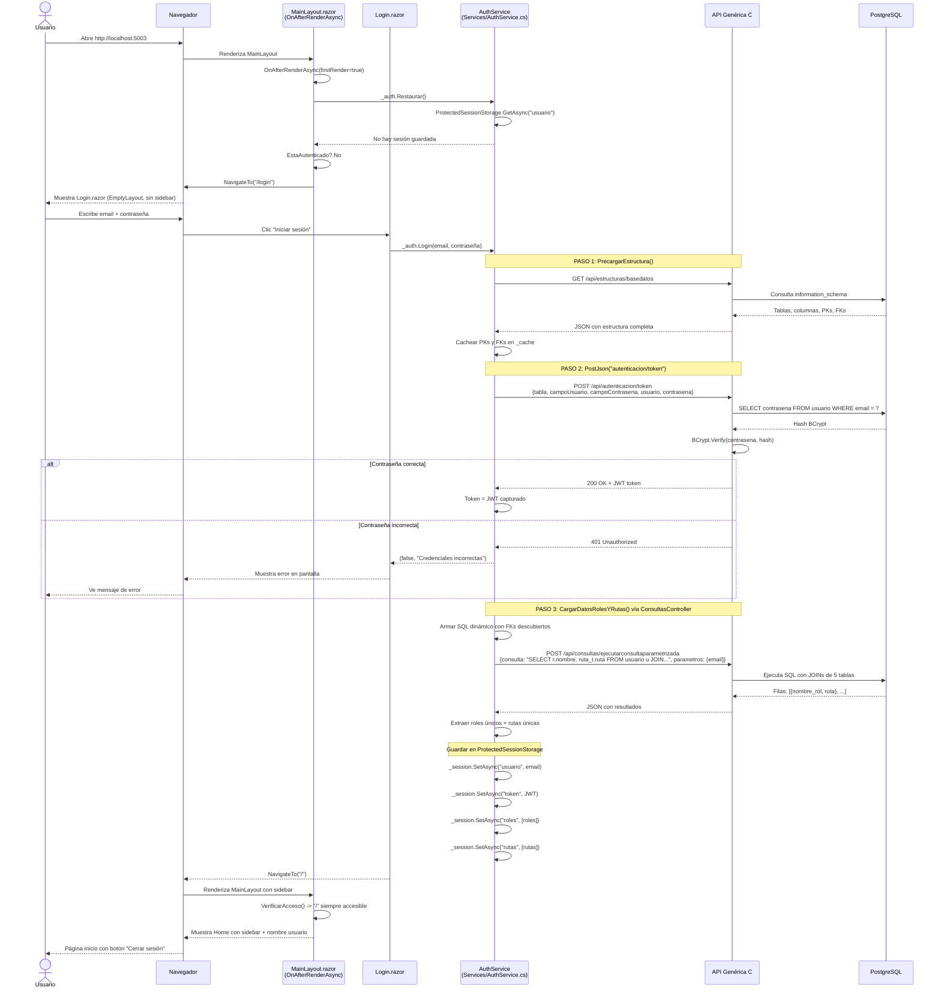
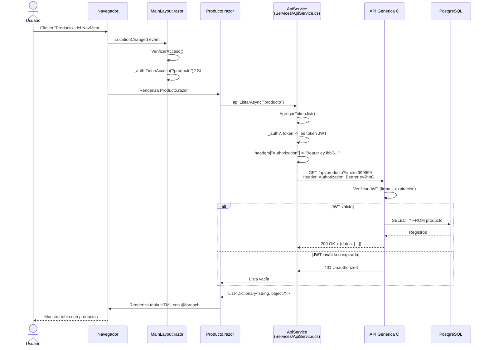
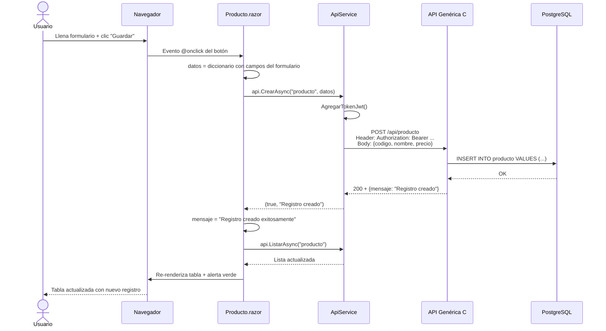
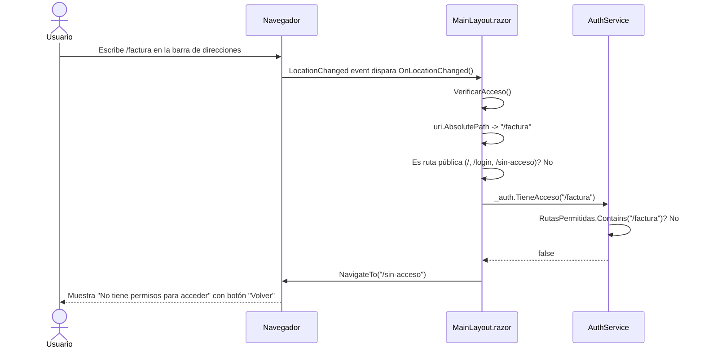
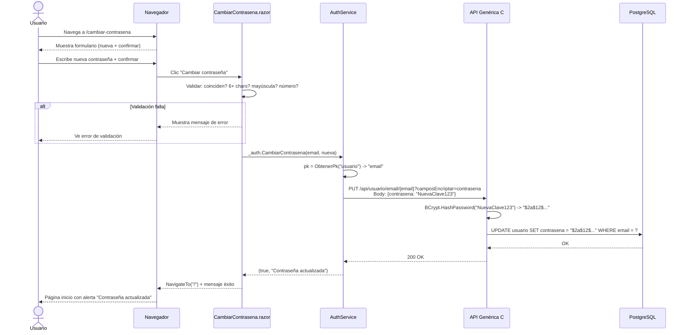
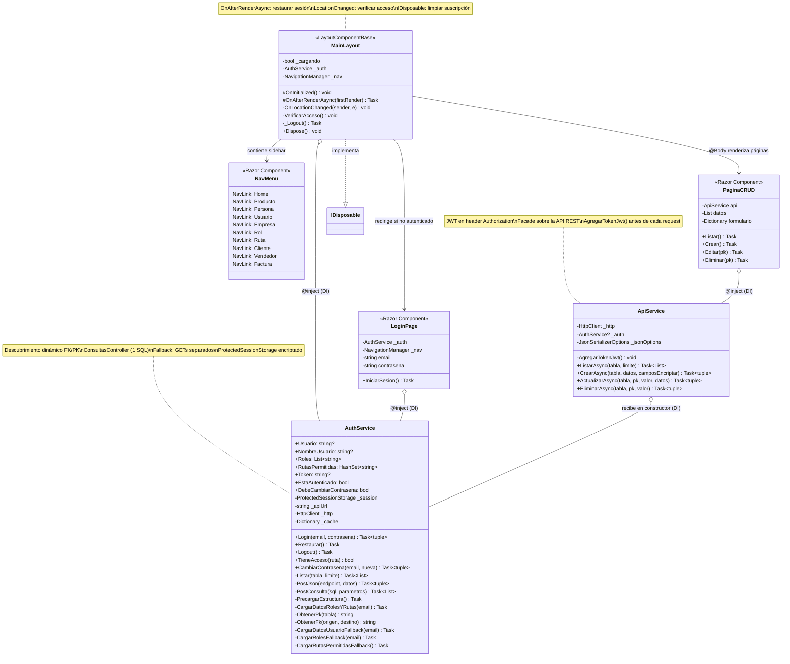

# Etapa 4: Plan de Implementación

> Según [Spec-Kit](https://github.com/github/spec-kit): el plan traduce los requisitos de la
> especificación en decisiones técnicas concretas. "Cada elección de tecnología tiene una
> rationale documentada." El plan se genera con `/speckit.plan` y el humano lo valida.
>
> Referencia: [plan-template.md](https://github.com/github/spec-kit/blob/main/templates/plan-template.md)

---

## 1. Resumen técnico

Frontend web en Blazor Server (.NET 9.0) que consume la API genérica C# vía HTTP.
Arquitectura basada en componentes: Services (lógica) + Pages (vistas Razor) + Layout (estructura).
Autenticación con BCrypt + JWT + ProtectedSessionStorage (sesión encriptada).
Control de acceso por roles y rutas con `LocationChanged` + `VerificarAcceso()` en MainLayout.
Inyección de dependencias (DI) registrada en `Program.cs`.

## 2. Estructura de archivos del proyecto

```
FrontBlazorTutorial/
├── FrontBlazorTutorial.csproj           <- Proyecto .NET 9.0 Blazor Server
├── FrontBlazorTutorial.sln              <- Solución Visual Studio
├── Program.cs                           <- Punto de entrada: DI, HttpClient, servicios
├── appsettings.json                     <- ApiBaseUrl, Smtp config
├── appsettings.Development.json         <- Config desarrollo
│
├── Services/
│   ├── ApiService.cs                    <- CRUD genérico: ListarAsync, CrearAsync, etc.
│   ├── AuthService.cs                   <- Login, roles, rutas, ConsultasController, fallback
│   └── SpService.cs                     <- Stored procedures
│
├── Components/
│   ├── App.razor                        <- HTML raíz, @rendermode="InteractiveServer"
│   ├── Routes.razor                     <- Router de Blazor
│   ├── _Imports.razor                   <- Usings globales
│   │
│   ├── Layout/
│   │   ├── MainLayout.razor             <- Layout: sidebar + top-row + auth + LocationChanged
│   │   ├── MainLayout.razor.css         <- Estilos del layout
│   │   ├── EmptyLayout.razor            <- Layout vacío para login (sin sidebar)
│   │   ├── NavMenu.razor                <- Menú lateral con NavLink
│   │   └── NavMenu.razor.css            <- Estilos del menú
│   │
│   └── Pages/
│       ├── Home.razor                   <- Página inicio
│       ├── Login.razor                  <- Formulario login (EmptyLayout)
│       ├── CambiarContrasena.razor      <- Cambiar contraseña con validación
│       ├── RecuperarContrasena.razor     <- Recuperar contraseña por SMTP
│       ├── SinAcceso.razor              <- Error 403 (no tiene permiso)
│       ├── Producto.razor               <- CRUD producto
│       ├── Persona.razor                <- CRUD persona
│       ├── Usuario.razor                <- CRUD usuario
│       ├── Cliente.razor                <- CRUD con selects FK
│       ├── Empresa.razor                <- CRUD empresa
│       ├── Vendedor.razor               <- CRUD vendedor
│       ├── Rol.razor                    <- CRUD rol
│       ├── Ruta.razor                   <- CRUD ruta
│       ├── Factura.razor                <- Maestro-detalle
│       └── Error.razor                  <- Página de error genérica
│
├── wwwroot/
│   ├── app.css                          <- Estilos custom
│   └── lib/bootstrap/                   <- Bootstrap 5 (incluido en plantilla)
│
├── Properties/
│   └── launchSettings.json              <- Puertos de desarrollo
│
├── script_bd/                           <- SQL para crear tablas
│
├── Paso0_PlanDeDesarrollo.md            <- Plan de desarrollo
├── Paso1 a Paso12*.md                   <- Tutorial paso a paso
│
└── sdd/                                 <- Documentación SDD (estos archivos)
```

## 3. Orden de implementación (por pasos)

> Cada paso corresponde a un Paso{N}.md del tutorial y a una o más ramas feature/.

| Orden | Paso | Qué se implementa | Dependencias | Estudiante |
|-------|------|--------------------|-------------|------------|
| 1 | Paso 0 | Plan de desarrollo, reglas | Ninguna | Todos |
| 2 | Paso 3 | Proyecto base: `dotnet new blazor`, Program.cs, git | Paso 0 | Est. 1 |
| 3 | Paso 4 | ApiService (CRUD genérico HTTP) | Paso 3 | Est. 1 |
| 4 | Paso 5 | Layout base, NavMenu, Home | Paso 4 | Est. 1 |
| 5 | Paso 6 | CRUD producto | Paso 5 | Est. 1 |
| 6 | Paso 7 | CRUD persona + usuario | Paso 5 | Est. 2 + 3 |
| 7 | Paso 8 | CRUD empresa, cliente, rol | Paso 7 | Est. 2 |
| 8 | Paso 9 | CRUD ruta, vendedor, NavMenu | Paso 7 | Est. 3 |
| 9 | Paso 10 | Factura maestro-detalle | Paso 8+9 | Est. 2 |
| 10 | Paso 12 | Login + JWT + control de acceso | Paso 9 | Est. 1 |

### Diagrama de dependencias

```
Paso 0 (plan)
  |
  v
Paso 3 (proyecto base: dotnet new blazor)
  |
  v
Paso 4 (ApiService)
  |
  v
Paso 5 (layout + NavMenu + home)
  |
  +-------+-------+
  v       v       v
Paso 6  Paso 7  (paralelo: producto, persona+usuario)
  |       |
  v       +-------+
  |       v       v
  |     Paso 8  Paso 9  (paralelo: empresa+cliente, ruta+vendedor)
  |       |       |
  |       v       v
  |     Paso 10   |   (factura, depende de 8+9)
  |               |
  +-------+-------+
          v
        Paso 12 (login + seguridad)
```

## 4. Modelo de datos

### Tablas CRUD (negocio)

| Tabla | PK | Campos clave | FKs |
|-------|-----|-------------|-----|
| producto | codigo | nombre, precio, existencia | - |
| persona | codigo | nombre, telefono, direccion | - |
| empresa | codigo | nombre, nit, direccion | - |
| cliente | id | credito | fkcodpersona->persona, fkcodempresa->empresa |
| vendedor | codigo | nombre, comision | - |
| usuario | email | contrasena (BCrypt), nombre | - |
| factura | numfactura | fecha, total | fkcodvendedor->vendedor, fkcodcliente->cliente |
| productosporfactura | id | cantidad, precio | fknumfact->factura, fkcodprod->producto |

### Tablas de seguridad (auth)

| Tabla | PK | Campos | FKs |
|-------|-----|--------|-----|
| rol | id | nombre | - |
| rol_usuario | id | - | fkemail->usuario, fkidrol->rol |
| ruta | id | ruta, descripcion | - |
| rutarol | id | - | fkidrol->rol, fkidruta->ruta |

## 5. Decisiones técnicas

| Decisión | Alternativa | Razón |
|----------|-------------|-------|
| ConsultasController (1 SQL) | 5 GETs separados | Eficiencia: BD filtra, no C# |
| ProtectedSessionStorage | Cookie / localStorage | Encriptación con Data Protection API |
| HttpClient inyectado por DI | RestSharp, Refit | Incluido en .NET, sin dependencias extra |
| Bootstrap incluido en wwwroot | CDN | Ya viene con la plantilla Blazor |
| LocationChanged + VerificarAcceso | Middleware HTTP | Blazor navega por SignalR, no HTTP |
| OnAfterRenderAsync | OnInitializedAsync | ProtectedSessionStorage necesita JS (post-render) |
| @rendermode="InteractiveServer" | Static SSR | Necesario para eventos, SignalR, ProtectedSessionStorage |

## 6. Endpoints de la API utilizados

### CRUD genérico (cada tabla)

```
GET    /api/{tabla}?limite=N           <- Listar
POST   /api/{tabla}                    <- Crear
PUT    /api/{tabla}/{pk}/{valor}       <- Actualizar
DELETE /api/{tabla}/{pk}/{valor}       <- Eliminar
```

### Autenticación y seguridad

```
POST   /api/autenticacion/token        <- Login BCrypt + JWT
GET    /api/estructuras/basedatos      <- Descubrir PKs/FKs
POST   /api/consultas/ejecutar...      <- SQL JOINs roles/rutas
PUT    /api/usuario/{pk}/{val}?camposEncriptar=contrasena  <- Cambiar clave
```

---

## 7. Diagramas de secuencia

> Los diagramas de secuencia muestran la interacción entre componentes en el tiempo.
> Formato: [Mermaid](https://mermaid.js.org/) — se renderiza automáticamente en GitHub.

### 7.1 Secuencia: Login completo



### 7.2 Secuencia: CRUD Listar con JWT (AgregarTokenJwt)



### 7.3 Secuencia: CRUD Crear



### 7.4 Secuencia: Acceso denegado (LocationChanged + VerificarAcceso)



### 7.5 Secuencia: Cambiar contraseña



---

## 8. Diagrama de clases

> Muestra las clases C# del proyecto, sus atributos, métodos y relaciones.
> Formato: [Mermaid](https://mermaid.js.org/) — se renderiza en GitHub.

### 8.1 Diagrama de clases completo



### 8.2 Relaciones entre clases

| Relación | Tipo | Descripción |
|----------|------|-------------|
| MainLayout -> NavMenu | Composición | MainLayout contiene NavMenu en el sidebar |
| MainLayout -> Pages | Composición | MainLayout renderiza páginas en @Body |
| MainLayout o-- AuthService | Inyección DI | @inject inyecta AuthService en MainLayout |
| Pages o-- ApiService | Inyección DI | @inject inyecta ApiService en cada página CRUD |
| LoginPage o-- AuthService | Inyección DI | Login usa AuthService para autenticar |
| ApiService o-- AuthService | Constructor DI | ApiService recibe AuthService para leer el token JWT |
| MainLayout ..|> IDisposable | Implementación | Limpia suscripción a LocationChanged al destruir |
| AuthService --|> ApiService | Independiente | AuthService NO depende de ApiService (usa HttpClient directo) |

### 8.3 Por qué AuthService es independiente de ApiService?

```
AuthService usa HttpClient directo, NO ApiService.

Razón: ApiService puede tener firmas diferentes según el proyecto
(ListarAsync vs Listar, parámetros distintos, etc).
AuthService con HttpClient directo funciona en CUALQUIER proyecto Blazor.

AuthService                    ApiService
  |                              |
  +-- HttpClient (directo)       +-- HttpClient (inyectado por DI)
  |   (métodos Listar, PostJson) |   (con AgregarTokenJwt del _auth)
  v                              v
  API Genérica C#                API Genérica C#
```

---

## Referencias Spec-Kit

- Formato plan: [plan-template.md](https://github.com/github/spec-kit/blob/main/templates/plan-template.md)
- Principio de simplicidad: [spec-driven.md, Artículo VII](https://github.com/github/spec-kit/blob/main/spec-driven.md)
- Flujo SDD: [README de Spec-Kit](https://github.com/github/spec-kit)
- Mermaid (diagramas): [mermaid.js.org](https://mermaid.js.org/)
